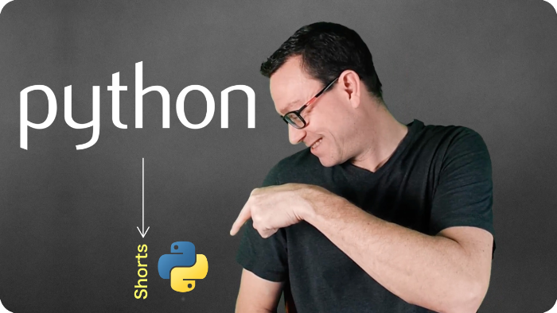

# Python shorts

Learn Python tips, tools, and techniques in around 5 minutes each.

## Watch on YouTube

[Subscribe on YouTube](https://talkpython.fm/python-shorts) to keep up with all the videos.

## Published videos

- [scheduled Jan 28, 2022] **Combining dictionaries, the Python 3.10 way**
- [scheduled Jan 25, 2022] **Beyond the List Comprehension**
- [scheduled Jan 22, 2022] **for-in Loops to List Comprehensions**
- **[Counting the number of times items appear with collections.Counter](https://youtu.be/0IHAm8cwlbQ)**
- **[Parsing data with Pydantic](https://youtu.be/aHv7-6WIxNM)**
